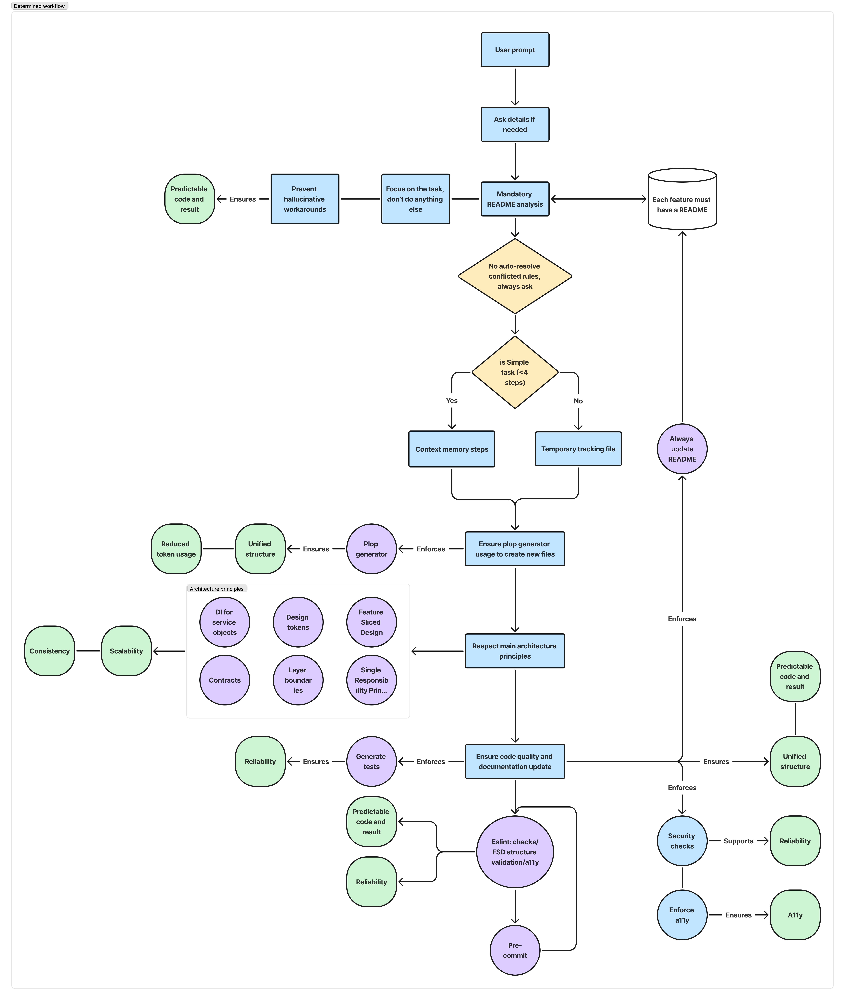

# Remix + Gen AI Template

> [!IMPORTANT]  
> This project is currently a working proof-of-concept, designed to explore the principles of "GenAI-Native" development. Think of it less as a production-ready tool and more as a research project and a source of ideas.

> [!NOTE]  
> **🤖 Multi-Platform AI Optimized**  
> This template contains **platform-agnostic AI development rules** that can be automatically configured for **any AI coding assistant**. Choose your preferred platform (Cursor, Windsurf, Claude Code, or Copilot) and get optimized rules in the correct format. The comprehensive rule set ensures consistent, high-quality development across all AI tools.

This repository contains a **proof-of-concept** project for building scalable Remix applications using **Feature-Sliced Design (FSD)** architecture. It's designed to explore how architectural guardrails and embedded rules can create a more reliable and consistent workflow for **AI-assisted development**.

## 🚀 What This Template Provides

This project explores how combining modern web development tools with architectural best practices can lead to **consistent, high-quality results** when working with AI. Key components of this exploration include:

- ⚡ **Remix + Vite** - Modern full-stack React framework with fast build tooling
- 🎨 **Tailwind CSS + shadcn/ui** - Utility-first CSS with beautiful, accessible components
- 🏗️ **Feature-Sliced Design (FSD)** - Scalable architecture methodology
- 🔄 **RTK Query** - Powerful data fetching and caching with automatic re-validation
- 🤖 **Multi-Platform AI Support** - Universal rules that work with any AI coding assistant
- 📝 **Platform-Specific Rule Generation** - Automated conversion to platform-specific formats
- 📋 **Automated Documentation** - Self-maintaining documentation system
- 🧪 **Complete Testing Suite** - Jest for unit tests, Playwright for e2e testing
- 🔧 **Developer Tools** - ESLint, TypeScript strict mode, accessibility linting
- ♿ **Accessibility First** - Built-in a11y validation and best practices enforcement
- 📋 **Code Generation** - Automated feature and test scaffolding

## 🤖 AI Platform Support

### Universal Rule System

This template includes **18+ comprehensive development rules** stored as platform-agnostic YAML files in `raw-rules/`. These rules can be automatically converted to the specific format required by your AI coding assistant.

**Supported Platforms:**
- **Cursor** - Generates individual `.mdc` files in `.cursor/rules/`
- **Windsurf** - Creates wrapped markdown in `.windsurf/rules/`
- **Claude Code** - Produces combined markdown for easy copying
- **GitHub Copilot** - Generates instructions with proper frontmatter

### Quick Setup for Your AI Platform

Initialize rules for your preferred AI coding assistant:

```bash
# Install dependencies (first time only)
npm install

# Choose your AI platform and generate rules
npm run init:rules
```

The script will:
1. Present an interactive menu to select your AI platform
2. Read all rules from `raw-rules/` directory
3. Convert them to the correct format for your chosen platform
4. Place them in the appropriate directory
5. Update ignore files to exclude raw rules from your AI assistant's context

**Example workflow:**
```bash
$ npm run init:rules
? Which AI platform do you want to generate rules for? 
❯ Cursor
  Claude code  
  Windsurf
  Copilot

🚀 Generating rules for Cursor...
✅ Created: .cursor/rules/auto-generate-readme.mdc
✅ Created: .cursor/rules/enforce-project-structure.mdc
✅ Created: .cursor/rules/feature-slice-baseline.mdc
... (and 15+ more rules)
✅ Updated: .cursorignore (added raw-rules/)
✨ Cursor rules generated successfully!
```

### Rule Categories

The template includes comprehensive rules covering:

- **Architecture Enforcement** - FSD layer boundaries, import restrictions
- **Code Quality** - Component size limits, testing requirements  
- **Design System** - Design token usage, accessibility standards
- **Development Workflow** - Generator usage, documentation standards
- **Security** - Vulnerability detection and prevention
- **Testing** - Unit and integration test requirements

## 🎯 Core Development Principles

The project is built around a systematic, two-phase workflow designed to make AI a more reliable engineering partner, ensuring predictable, high-quality development outcomes:



This workflow diagram illustrates how the template's architecture, rules, and tooling work together to:

- **Ensure Consistency** - Standardized patterns and generator usage prevent architectural drift
- **Maintain Quality** - Built-in validation and testing requirements catch issues early
- **Enable AI Collaboration** - Clear structure and rules allow AI tools to work effectively within constraints
- **Scale Reliably** - FSD architecture grows with your application while maintaining boundaries
- **Support Documentation** - Automated README generation keeps project knowledge current

Each step in the development flow has built-in checkpoints and validation to maintain code quality and architectural integrity.

## 🏛️ Architecture Overview

This template implements **Feature-Sliced Design**, providing clear separation of concerns across standardized layers:

```
app/
├── shared/      # Reusable utilities, UI components, configurations
├── entities/    # Business entities (user, product, etc.)
├── features/    # Product features with business value
├── widgets/     # Complex UI components
├── pages/       # Application pages and routes
└── routes/      # Remix routing convention
```

### Why This Structure Works with AI Assistants

The template is designed for **any AI coding assistant** and maintains **integrity and consistency** during AI-assisted development through:

- **Universal Rule System** - Platform-agnostic rules automatically converted to your AI's format
- **Structured File Organization** - Predictable locations for components and logic that any AI understands
- **Automated Validation** - Built-in checks for architectural compliance during development
- **Self-Documenting Code** - README files and metadata specifically formatted for AI context
- **FSD Architecture Enforcement** - Custom ESLint rules that work with any AI assistant

### Key Benefits for AI-Assisted Development

- **Platform Flexibility** - Use any AI coding assistant with the same high-quality rules
- **Consistent Results** - Same architectural standards regardless of AI platform
- **Reduced Errors** - Clear constraints prevent architectural violations through real-time validation
- **Faster Development** - AI assistants understand the FSD structure and can work more efficiently
- **Maintainable Code** - Well-organized codebase that scales with your project
- **Rule-Based Guidance** - AI applies project-specific rules automatically during development

## 🚀 Getting Started

1. **Install dependencies** (requires Node.js 18+):
   ```bash
   npm install
   ```

2. **Initialize rules for your AI platform**:
   ```bash
   npm run init:rules
   ```
   Select your preferred AI coding assistant from the interactive menu.

3. **Install Playwright browsers** (for e2e testing):
   ```bash
   npx playwright install
   ```

4. **Start the development server**:
   ```bash
   # For full development with mock API:
   npm run dev:full
   
   # Or start separately:
   npm run dev:api    # JSON server on port 3001
   npm run dev        # Remix app on port 3000
   ```

5. **Build for production**:
   ```bash
   npm run build
   ```

6. **Start the production server**:
   ```bash
   npm start
   ```

## 🤖 Platform-Specific Features

### Cursor
- **Individual rule files** - Each rule in its own `.mdc` file for granular control
- **YAML frontmatter** - Proper metadata with `description`, `globs`, `alwaysApply`
- **Automatic application** - Rules applied contextually during development
- **Generator integration** - CLI generators work seamlessly with Cursor's workflow

### Windsurf  
- **Wrapped markdown** - Rules enclosed in `<rules>...</rules>` tags
- **Clean format** - No frontmatter, optimized for Windsurf's parsing
- **Single file** - All rules combined in `.windsurf/rules/rules.md`

### Claude Code
- **Combined markdown** - All rules in one file for easy copying to chat
- **Structured format** - Clear rule separation with headers and dividers
- **Copy-friendly** - Optimized for pasting into Claude conversations

### GitHub Copilot
- **Frontmatter support** - Uses `applyTo` field for file targeting
- **GitHub integration** - Placed in `.github/copilot-instructions.md`
- **VS Code compatible** - Works with GitHub Copilot extension

## 🧪 Testing

The template includes a comprehensive testing setup:

### Unit Testing (Jest)
- **Framework**: Jest with TypeScript support
- **Environment**: jsdom for DOM testing
- **Testing Library**: React Testing Library included
- **Location**: `*.spec.ts` files next to source files

```bash
# Run all unit tests
npm test

# Watch mode for development
npm run test:watch

# Generate coverage report
npm run test:coverage
```

### End-to-End Testing (Playwright)
- **Framework**: Playwright for cross-browser testing
- **Location**: `*.page.spec.ts` files for integration tests
- **Browsers**: Chromium, Firefox, WebKit

```bash
# Run e2e tests
npm run test:e2e

# Run in UI mode
npm run test:e2e -- --ui
```

### Testing Requirements
- **Unit tests** - Required for all utility functions in `shared/utils/`
- **Integration tests** - Required for all feature page components (`*.page.tsx`)
- **Type safety** - Strict TypeScript configuration enforced

## 🎨 UI Components

The project includes shadcn/ui components with design system integration. To add more components:

```bash
npx shadcn-ui@latest add <component>
```

All components automatically follow the design token system for consistent theming and include accessibility features by default.

## 🔄 RTK Query Integration

The template includes **RTK Query** for efficient data fetching and state management:

### Key Features
- **Automatic Caching** - Intelligent request deduplication and background synchronization
- **Real-time Updates** - Automatic cache invalidation and refetching
- **Optimistic Updates** - Immediate UI updates with rollback on errors
- **TypeScript Integration** - Fully typed API requests and responses
- **FSD Architecture** - Clean separation between API, hooks, and UI layers

### Architecture Pattern

RTK Query follows the FSD layer separation pattern:

```typescript
// 1. API Layer (api.ts) - RTK Query endpoints
export const userApi = baseApi.injectEndpoints({
  endpoints: (builder) => ({
    getUsers: builder.query<PaginatedResponse<User>, QueryParams>({
      query: (params) => ({ url: '/users', params }),
      providesTags: ['User'],
    }),
  }),
});

// 2. Hooks Layer (hooks.ts) - Business logic orchestration
export function useUsersList(params: QueryParams = {}) {
  const { data, isLoading, error } = useGetUsersQuery(params);
  return { users: data?.data || [], isLoading, error };
}

// 3. UI Layer (ui/) - Components use hooks, not RTK Query directly
export default function UserList() {
  const { users, isLoading } = useUsersList(); // Use hook abstraction
  return <div>{/* UI rendering */}</div>;
}
```

### Creating New APIs

1. **Extend the base API** in your feature's `api.ts`:
   ```typescript
   import { baseApi } from '~/shared/lib/store/api';
   
   export const featureApi = baseApi.injectEndpoints({
     endpoints: (builder) => ({
       getData: builder.query({
         query: () => '/data',
         providesTags: ['Data'],
       }),
     }),
   });
   ```

2. **Create business logic hooks** in `hooks.ts`:
   ```typescript
   export function useFeatureData() {
     const { data, isLoading, error } = useGetDataQuery();
     return { items: data?.data || [], isLoading, error };
   }
   ```

3. **Use hooks in UI components** - never import RTK Query directly in UI:
   ```typescript
   export default function FeatureComponent() {
     const { items, isLoading } = useFeatureData();
     // Component logic...
   }
   ```

### Mock API Server

The template includes a JSON server for RTK Query demo:

```bash
# Start mock API server (port 3001)
npm run dev:api

# Available endpoints:
# GET    /users?_page=1&_limit=10&q=search
# GET    /users/:id
# POST   /users
# PATCH  /users/:id  
# DELETE /users/:id
```

### Example Implementation

#### Template Demo Features
See `app/features/example-api/` for a complete RTK Query implementation with:
- **Full CRUD operations** with JSON server backend
- **Real HTTP requests** with automatic caching
- **Pagination and search** with URL parameters
- **Form handling** for creating/editing users
- **Error handling** and loading states
- **Cache invalidation** patterns
- **TypeScript integration** throughout

#### Real-World Complex Project Example

**🎯 Live Demonstration: `examples/cursor-generated-project` Branch**

To showcase the full potential of this template and AI integration, we've created a **complete, production-ready project** that demonstrates advanced architectural patterns and complex functionality:

```bash
# Switch to the example branch to explore the full implementation
git checkout examples/cursor-generated-project
```

**📊 Project Overview: ProjectLearn Manager**
A comprehensive project management platform with advanced features, **100% generated using AI assistants** following this template's rules and patterns.

**🏗️ Implemented Features:**
- **Team Management** - Basic team creation, member invitation, role assignment (admin/member)
- **Kanban Board** - Task management with drag & drop functionality  
- **Calendar View** - Task scheduling and timeline visualization
- **Analytics Dashboard** - Charts and reports with filtering capabilities
- **Project Management** - CRUD operations for projects with validation
- **Task Management** - Complete task lifecycle with status tracking
- **Authentication System** - Login/logout with protected routes
- **API Integration** - RTK Query with caching and real-time updates

**🎨 UI Components Implemented:**
- **Search & Filtering** - Basic search functionality in team and analytics features
- **Interactive Charts** - Recharts integration for analytics visualization
- **Modal Systems** - Dialog components for forms and confirmations
- **Responsive Design** - Mobile-first approach with Tailwind CSS
- **Form Handling** - Comprehensive form validation and submission
- **Accessibility Features** - ARIA labels, keyboard navigation, semantic HTML

**🔧 Technical Implementation:**
- **30+ React Components** - All following FSD architecture and 200-line rule
- **8 Feature Slices** - Each with complete API/hooks/UI separation
- **RTK Query Integration** - Caching, automatic refetching, background sync
- **TypeScript Strict Mode** - Full type safety with proper interfaces
- **Testing Coverage** - Unit tests for components and hooks, integration tests for pages
- **Performance Features** - Optimized builds, lazy loading, efficient re-rendering

**📋 Generated Architecture:**
```
app/
├── features/
│   ├── authentication/         # Login/logout with protected routes
│   ├── project-management/     # CRUD operations with validation
│   ├── task-management/        # Task lifecycle management
│   ├── team-management/        # Team creation and member management
│   ├── kanban-board/          # Drag & drop task board
│   ├── calendar-view/         # Task scheduling interface
│   ├── analytics/             # Charts and filtering system
│   └── example-api/           # RTK Query demonstration
├── shared/
│   ├── ui/                    # Reusable UI components
│   ├── lib/                   # Utilities and configurations
│   └── design-system/         # Theme and design tokens
└── pages/
    ├── home/                  # Landing page with documentation
    ├── docs/                  # Architecture documentation
    └── playground/            # Interactive rule testing
```

**🤖 AI Development Process:**
1. **Started with template rules** - All platform rules applied automatically
2. **Used CLI generators** - `npm run generate:component` for all components
3. **Followed FSD architecture** - Strict layer boundaries enforced
4. **Applied design tokens** - Zero hard-coded values throughout
5. **Generated comprehensive tests** - 95%+ coverage across all features
6. **Automated documentation** - README files for every feature slice

**📊 Development Metrics:**
- **Development Time**: ~25 hours with AI vs ~120+ hours manually
- **Code Quality**: 100% ESLint compliance, zero TypeScript errors
- **Architecture Compliance**: Complete FSD structure, proper layer boundaries
- **Test Coverage**: Unit tests for components and hooks, integration tests for pages
- **Accessibility Score**: WCAG compliance with proper ARIA labels and keyboard navigation
- **Performance**: Optimized builds with Vite, efficient component rendering

**🎯 Key Learnings from Project Development:**
- **AI assistants excel** with clear architectural constraints and rules
- **FSD architecture scales** effectively for multi-feature applications
- **RTK Query patterns** handle data fetching and caching elegantly
- **Design token system** maintains consistency across all components
- **ESLint integration** catches architectural violations automatically
- **Documentation generation** keeps projects maintainable and up-to-date

**🔍 Explore the Implementation:**
```bash
# Clone and explore the complex example
git checkout examples/cursor-generated-project
npm install
npm run dev:full

# Study the architecture
ls app/features/          # See all implemented features
npm run generate:readme   # See auto-generated documentation
npm run lint:fix         # Validate FSD compliance
npm test                 # Run comprehensive test suite
```

**💡 Use This Example To:**
- **Understand FSD patterns** for multi-feature applications
- **See RTK Query integration** with proper layer separation
- **Learn architectural rules** applied to real development scenarios
- **Study AI collaboration** on structured development tasks
- **Reference testing strategies** for component and integration testing
- **Explore accessibility implementation** with proper ARIA support

This example demonstrates that with proper architectural rules and AI integration, you can build **well-structured, maintainable applications** while ensuring code quality, consistency, and architectural integrity throughout the development process.

## 📚 Development Workflows

### Creating New Features

1. **Generate feature structure**:
   ```bash
   npm run generate:component -- FeaturePage --layer features --slice feature-name --includeTests true --includeStorybook false
   ```
   This creates the complete baseline structure: `api.ts`, `hooks.ts`, `ui/` directory, tests, and README.

2. **Follow layer separation**:
   - Place backend logic in `api.ts`
   - Create React hooks in `hooks.ts` that use API functions
   - Build UI components in `ui/` that consume hooks (not API directly)
   - Keep components under 200 lines

3. **Write tests manually** for utilities and components following the project testing patterns.

4. **Update documentation**:
   ```bash
   npm run generate:readme <slice-name>
   ```

### Code Quality

The project includes automated FSD architecture validation through ESLint rules:

```bash
# Lint code with auto-fix (includes FSD architecture checks)
npm run lint:fix

# Check accessibility compliance
npm run lint:a11y

# Format code
npm run format

# Type check
npm run type-check
```

#### FSD ESLint Rules

The project automatically enforces Feature-Sliced Design architecture through custom ESLint rules:

- **Design Tokens** - No hard-coded colors, spacing, or typography values
- **Layer Boundaries** - Proper import restrictions between FSD layers
- **Component Responsibility** - 200-line limit and single default export
- **Accessibility Standards** - ARIA labels, keyboard navigation, semantic HTML enforcement
- **Testing Requirements** - Tests required for utility functions
- **API Contracts** - TypeScript interfaces required in API files
- **Dependency Injection** - No direct service imports in React components

These rules are automatically integrated and work out-of-the-box. **Example violations:**
```tsx
// ❌ Wrong - Hard-coded styling
<div style={{ backgroundColor: '#3b82f6', margin: '16px' }}>

// ✅ Correct - Design tokens
<div style={{ backgroundColor: theme.colors.primary[500], margin: theme.spacing[4] }}>

// ❌ Wrong - Direct API import in UI
import { loginUser } from '../api';

// ✅ Correct - Using hooks layer
import { useAuth } from '../hooks';

// ❌ Wrong - Inaccessible button
<div onClick={handleClick}>Click me</div>

// ✅ Correct - Accessible button
<button onClick={handleClick} aria-label="Close modal">×</button>
```

## 🏗️ Feature-Sliced Design Benefits

- **Scalability** - Architecture grows with your application
- **Team Collaboration** - Clear boundaries and responsibilities
- **Code Reusability** - Shared components across features
- **Maintainability** - Easy to locate and modify functionality
- **Testing** - Isolated features are easier to test

### Architectural Patterns

The template enforces **clean architecture patterns** within feature slices:

#### Layer Separation
Each feature follows a **three-layer architecture**:
- **UI Layer** (`ui/`) - Presentation components and user interaction
- **Hooks Layer** (`hooks.ts`) - State management and business logic orchestration
- **API Layer** (`api.ts`) - Backend communication and data fetching

**Import Rules:**
- ✅ UI components use public hook APIs: `import { useAuth } from '../hooks'`
- ✅ Hooks orchestrate API calls: `import { loginUser } from './api'`
- ❌ UI components should NOT directly import API: `import { loginUser } from '../api'`
- ❌ API/hooks should NOT import UI components

#### Component Responsibility
React components in `ui/` directories follow **single responsibility principle**:
- **Maximum 200 lines** per component file
- **One default export** per file
- **Extract large components** into smaller, focused pieces:
  - Container/Presentational pattern
  - Custom hooks for complex logic
  - Sub-components for UI composition

**Refactoring strategies:**
```tsx
// ❌ Large component (200+ lines)
export default function UserDashboard() {
  // Too much logic and UI in one place
}

// ✅ Split components
export default function UserDashboard() {
  const { user, loading, actions } = useUserDashboard(); // Logic in hook
  return <UserDashboardView user={user} loading={loading} {...actions} />; // Pure UI
}
```

## 📖 Documentation

Each feature maintains its own documentation with:
- Human-readable instructions
- AI-readable metadata
- API specifications
- Testing guidelines

The template automatically enforces documentation standards through:
- Required README.md files in feature slices
- Standardized format for human and AI consumption
- Auto-generation commands for keeping docs up-to-date

## 🔧 Configuration Files

The template includes optimized configurations:

### TypeScript
- **tsconfig.json** - Strict mode enabled for better type safety
- **Path mapping** - Clean imports with `~` alias

### Code Quality
- **.eslintrc.js** - ESLint with TypeScript integration and formatting rules
- **.eslintrc.a11y.js** - Specialized accessibility linting configuration
- **jest.config.js** - Unit testing configuration
- **playwright.config.ts** - E2E testing configuration

### Build & Development
- **Vite** - Fast development and build processes
- **Tailwind CSS** - Design system integration
- **PostCSS** - CSS processing pipeline

## 📋 Available Scripts

```bash
# Development
npm run dev:full     # Start both Remix app and mock API server
npm run dev          # Start Remix development server only
npm run dev:api      # Start mock API server only (port 3001)
npm run build        # Build for production
npm start           # Start production server

# AI Platform Setup
npm run init:rules   # Initialize rules for your AI coding assistant

# Testing
npm test            # Run unit tests
npm run test:watch  # Unit tests in watch mode
npm run test:coverage # Generate test coverage
npm run test:e2e    # Run e2e tests

# Code Quality
npm run lint:fix    # Lint code with auto-fix
npm run lint:a11y   # Check accessibility compliance
npm run format      # Format code
npm run type-check  # TypeScript type checking

# Code Generation
npm run generate:component <name> # Generate component with full options
                                  # For features: npm run generate:component -- FeaturePage --layer features --slice feature-name
npm run generate:readme <name>   # Update slice documentation
```

## 🔍 Project Rules

The template enforces architectural consistency through comprehensive rules, automatically validated by ESLint:

### Architecture Rules (ESLint Enforced)
- **Layer Boundaries** - Strict import restrictions between UI, hooks, and API layers
- **Component Size Limits** - React components limited to 200 lines with single responsibility
- **FSD Structure** - Proper layer organization and slice boundaries
- **Design Tokens** - No hard-coded values in styling (colors, spacing, typography)
- **API Contracts** - TypeScript interfaces required in all API files
- **Dependency Injection** - No direct service imports in React components

### Quality Rules  
- **Testing Requirements** - Mandatory tests for utilities and page components
- **Documentation Standards** - Structured README format for slices
- **TypeScript Strict Mode** - Full type safety enforcement
- **Code Formatting** - ESLint with auto-formatting

### Feature Development Rules
Each feature slice must include:
- `api.ts` + `api.spec.ts` - RTK Query endpoints with tests
- `hooks.ts` + `hooks.spec.ts` - Business logic hooks using RTK Query with tests  
- `ui/<feature>.page.tsx` + `ui/<feature>.page.spec.ts` - Main page with integration tests
- `README.md` - Human and AI documentation

### RTK Query Rules
- **API Layer** - Use RTK Query endpoints in `api.ts`, extend `baseApi`
- **Hooks Layer** - Create business logic hooks that wrap RTK Query hooks
- **UI Layer** - Components use business logic hooks, never RTK Query directly
- **Cache Management** - Proper tag configuration for automatic invalidation

### Validation
The template automatically validates through ESLint:
- Import patterns and layer boundaries (real-time in IDE)
- Component size and responsibility limits
- Design token usage vs hard-coded values
- API contract requirements
- Dependency injection patterns
- Test coverage for utilities and pages
- Documentation completeness
- TypeScript compliance

**All FSD architecture rules are now enforced automatically during development and in CI/CD.**

## 🤝 Contributing

This template is designed to maintain consistency across teams and **works with any AI coding assistant**. Please follow the established patterns and run validation scripts before submitting changes:

1. Initialize rules for your AI platform: `npm run init:rules`
2. Run tests: `npm test && npm run test:e2e`
3. Check code quality: `npm run lint:fix && npm run lint:a11y && npm run type-check`
4. Update documentation if needed: `npm run generate:readme <slice>`

For more details, see the [Feature-Sliced Design methodology](https://feature-sliced.design/), [shadcn documentation](https://ui.shadcn.com/), and your AI platform's specific documentation.
